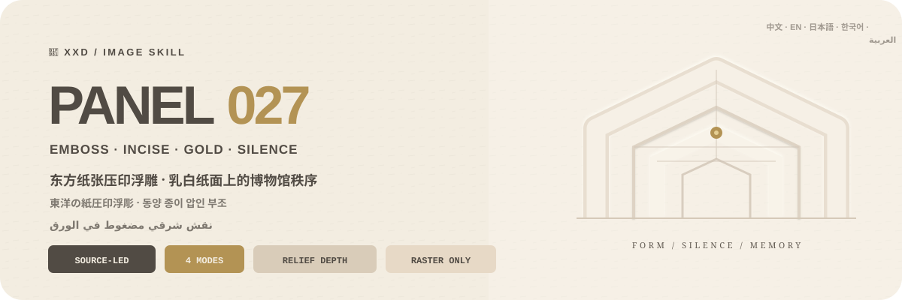
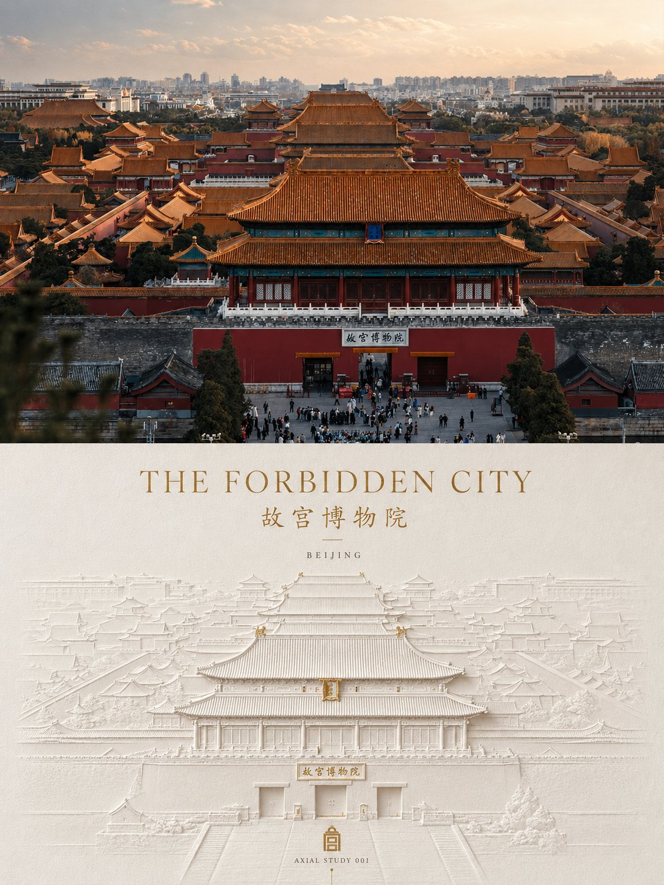
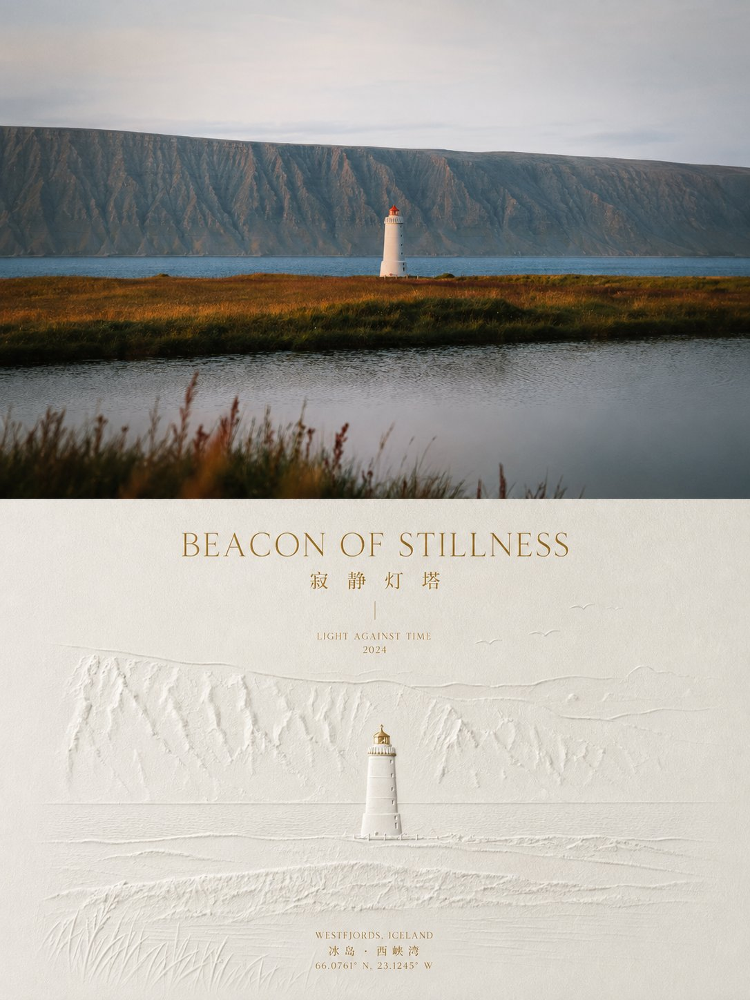
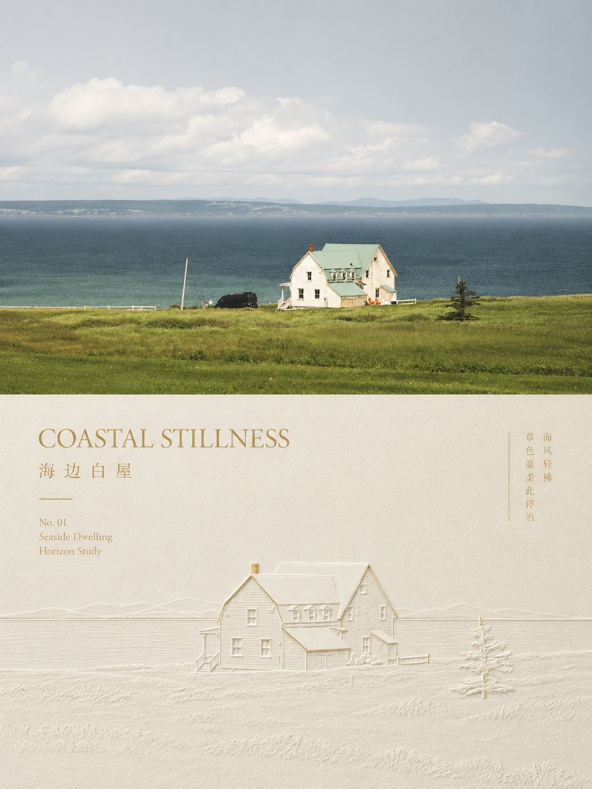
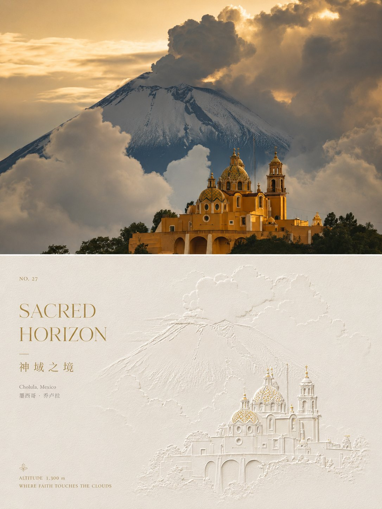

<p align="center">
  
</p>

<div align="center">

# 🦁 XXD Panel 027

### 写真を、乳白紙に静かに刻まれた東洋の博物館レリーフへ

[](./SKILL.md)
[](#4つの出力を支えるひとつのエンボスレリーフロジック)
[](#境界と信頼性)

<a href="README.md">简体中文</a> · <a href="README.en.md">English</a> · <strong>日本語</strong> · <a href="README.ko.md">한국어</a> · <a href="README.ar.md">العربية</a>

</div>

> 厚い乳白紙 · 浅い凸凹 · 細い線刻 · 艶消し金の焦点 · 博物館の秩序

XXD Panel 027 は、Codex と互換 Agent のための画像生成 Skill です。主体の個性、シルエット、姿勢、物語関係を保ち、厚い乳白紙へ押された東洋的な浅浮彫へ再構成します。凸縁、凹み、細い線刻、高低差、繊細な影で、写真の細部を機械的に写さずに識別性を保ちます。

俯瞰、正面、微俯瞰、軸方向の展開から、主体を最も保てる視点を選びます。乳白、暖白、淡い紙色と広い余白が中心で、決定的な識別点だけにごく小さな艶消し金を使えます。柔らかな暖光が紙繊維と圧印の高さを示し、文字は軸、浮彫の下、余白の縁、構造輪郭へ揃えます。

## なぜ 027 が必要なのか

一般的な「浮彫風」は、ワンクリックの3Dベベル、白い石膏像、高級包装の型押し、大量の金装飾へ崩れ、元写真が汎用アイコンになりがちです。

027 は順序を逆にします。

```text
個性／輪郭／姿勢／関係を固定 → 元写真に根拠のある視点と軸を選ぶ → 固有の浮彫高低図を作る → 浅い凸凹、線刻、段差で主体を要約 → 乳白紙と余白に静けさを担わせる → 金は一つの決定点だけに使う → 読める文字を展示構造へ揃える
```

無関係な写真に替えても浮彫の輪郭、高低図、視点軸、環境線、金の焦点、文字関係がほぼ成立するなら、それは 027 ではありません。

## 027 のビジュアル契約

- **元写真の個性：** 三つ以上の固有手掛かりで、輪郭、姿勢、動き、構造、尺度、負形、関係を保ちます。
- **元写真に即した視点：** 俯瞰、正面、微俯瞰、軸方向から個性と空間関係を最も保つ視点を選びます。
- **本物の浅浮彫：** エンボス、デボス、細い線刻、紙の段差、柔らかな縁影が厚紙の物理尺度に収まります。
- **博物館の秩序：** 静かな中央軸または根拠ある偏軸、明快な階層、広い余白が一つの浮彫を支えます。
- **同系の紙面：** 乳白、暖白、クリーム、淡い紙色を使い、高低差と静かな影で奥行きを作ります。
- **艶消し金の焦点：** 根拠ある識別点一つだけに極少量を使い、広い金装飾はしません。
- **実在する素材：** 柔らかな暖光が紙繊維、圧印縁、凹み、段差、自然な影を明確にします。
- **展示文字：** ごく短い題と小文字を軸、浮彫の下、余白縁、構造輪郭へ揃えます。

## 作例 · X より

> [小小東（@xiaoxiaodong01）](https://x.com/xiaoxiaodong01/status/2090444626285261046) · 2026-08-20<br>
> GPT2 x 浮雕 x 金 x 高级 x 美学提示词 x VOL.027

<table>
  <tr>
    <td width="50%"><a href="https://x.com/xiaoxiaodong01/status/2090444626285261046"></a></td>
    <td width="50%"><a href="https://x.com/xiaoxiaodong01/status/2090444626285261046"></a></td>
  </tr>
  <tr>
    <td width="50%"><a href="https://x.com/xiaoxiaodong01/status/2090444626285261046"></a></td>
    <td width="50%"><a href="https://x.com/xiaoxiaodong01/status/2090444626285261046"></a></td>
  </tr>
</table>

<p align="center"><a href="https://x.com/xiaoxiaodong01/status/2090444626285261046">元の投稿と完全なプロンプトを見る →</a></p>

これらの作例は 027 の美的意図を示すものであり、作例の被写体、構図、配色、コピー、旧キャンバス比率が生成時の参照や現在の既定値になることはありません。

## 組み合わせ可能な4つの出力

`1`、`1+3`、`1,2,4`、`全部` で一つまたは複数を選べます。`全部` は元画像ごとに7点の独立PNGを出力します。モード選択後、生成前に完成画像全体の画角を必ず確認します：元プロンプトの `3:4`、明示的な元画像比率、一般的な比率、またはカスタム比率／正確なピクセルです。元画像寸法を暗黙には適用しません。

| モード | 画角ルール | 成果物 |
| --- | --- | --- |
| `top-bottom` | ユーザー確認済みの完成画角 | 完成キャンバスを一度に生成：上に高忠実度の元画像、下に 027 デザイン、約50/50 |
| `left-right` | ユーザー確認済みの完成画角 | 完成キャンバスを一度に生成：左に高忠実度の元画像、右に 027 デザイン、約50/50 |
| `design-only` | ユーザー確認済みの完成画角 | 027 デザインが全画面を満たし、元画像は表示しない |
| `wallpaper-pack` | 端末ごとに確認 | スマートフォン、iPad、デスクトップ、子ども用ウォッチの個別PNG |

二連モードは元画像を高忠実度の編集／参照入力として使い、完全なスタイルプロンプト一式で完成画面を直接生成します。写真、デザイン、色、光、文字、意味を一体化するためです。決定論的な合成は、完成画面の再試行後も失敗した場合、原画像のピクセル完全保持を明示された場合、生成経路が指定画角に対応しない場合、または無劣化の最終ピクセル調整が必要な場合だけ使います。

壁紙は連動または独立を選べます。連動はiPad基準作を一つ承認し、他の端末を元画像＋同じ基準作から個別に再構成します。独立は各端末が元画像だけを参照します。どちらも他端末の成果を切り抜かず、派生を連鎖しません。

## 文字は浮彫と展示秩序を共有する

生成前に、自動文案、カスタム文案、文字なしを選びます。文字を入れる場合は対象言語または地域も指定します。

自動文案は、根拠ある主体の個性、場所性、主題、動き、関係、象徴からごく短い題を作ります。本当に深まる場合だけ0〜3個のキーワード、番号、小注を加えます。哲理的な一文は元写真が明確に支える時だけ使い、一般的な励まし文句にしません。

場所、日付、出典、事実番号はユーザー提供または確実な根拠が必要で、捏造しません。対象文字体系に自然な上質の明朝／セリフ相当を深灰、浅い空押し、極少量の艶消し金で使い、中央／元写真の軸、浮彫の下、余白縁、構造輪郭へ揃えます。

ユーザーが完成稿を渡した場合は一字一句保ちます。方向や編集可能な草稿の場合だけ、対象、目的、必須語、語調、含意を守りながら磨きます。

言語は命令文ではなく、想定する読者に従います。

```text
対象市場・読者 > 指定された成果物言語 > 方向指示の言語；不明なら生成前に確認
```

日本版は自然な現代日本語、韓国向けは自然な韓国語と正しい分かち書き、英国版は英国英語、アラビア語版は原則として自然な現代標準アラビア語と正しい右から左の組版を使います。外見、服装、風景、看板から国籍を推測せず、雰囲気づくりの偽外国語も使いません。

## 完成キャンバス優先とラスター境界

画像モデルが完成画面全体の美的再構成を担当し、二連レイアウトも完成キャンバス一枚の直接生成を既定とします。`scripts/compose_panel.py` は条件付きの復旧、無劣化ピクセル調整、読み取り専用監査にだけ残し、毎回の事前計画や美的評価には使いません。

納品物はすべてPNGラスターで、呼び出しごとに `~/Desktop/xxd/` に新規タスクを作ります。設定済み画像経路は匿名化された状態だけを返し、提供元、接続先、認証情報、ヘッダー、プロンプト、応答、アカウント情報を公開しません。SVG、HTML、Canvas、図解、プログラム描画は最終作品の代替になりません。

## 選択式 UI とインラインパラメータ

実行環境に本物の対話コントロールがある場合、カード式の選択を優先します。出力モードと通常画像サイズは複数選択、文案方式と壁紙の関係は単一選択です。サイズは自動調整、元画像比率、1:1、3:4、4:3、4:5、5:4、2:3、3:2、9:16、16:9、21:9、5:7、7:5、カスタム比率／ピクセルから選べます。対話コントロールがない環境では、クリックできない疑似チェックボックスではなく、読みやすい複数行の番号メニューに切り替えます。

すべての設定は呼び出し後の変数として直接指定できます。

```text
/xxd-panel-027 photo.jpg --mode top-bottom,design-only --size auto,3:4,9:16 --text auto --locale ja-JP
```

`--mode`、複数指定可能な `--size`、`--text auto|custom|none`、`--locale`、`--copy`、`--wallpaper linked|independent`、`--wallpaper-size`、`--out` に対応します。必要な値が揃っていれば質問を省略して生成を開始し、不足分だけを追加で尋ねます。異なる縦横比はそれぞれ再構成し、四端末壁紙は通常サイズと機械的に掛け合わせない独立分岐です。

## 画像モデルの優先順位

GPT Image 2 を既定の第一候補とします。高忠実度の参照画像、生成前の完成キャンバス確認、二連モードの完成画面一括生成、条件を満たした場合だけのスクリプト合成という既存の流れは変わりません。

現在のツールまたは設定済み経路から実際に利用でき、元画像の忠実度、完成画角、対象言語の文字、連動壁紙の複数参照を満たせる場合は、Seedance 5.0 Pro、Nano Banana Pro（Gemini Image Pro）、Nano Banana 2（Gemini Image Flash）、その他の互換ビットマップモデルも利用できます。代替モデルが変更できるのは生成経路だけで、モード、画角、文案、言語、壁紙関係、完成キャンバス優先の方針は変更できません。

適切な経路がない場合は、画像生成ツールを有効にするか API Key を提供するようユーザーに案内します。ユーザーが提供した認証情報は現在のタスクで利用できますが、返信やログに再表示・記録・開示しません。明示的な依頼がない限り、長期保存やプロバイダー、アカウント、課金、グローバル経路の設定変更も行いません。

## 使い始める

```bash
git clone https://github.com/nevertoday/xxd-panel-027.git
mkdir -p ~/.codex/skills
ln -s "$(pwd)/xxd-panel-027" ~/.codex/skills/xxd-panel-027
```

Claude Code では同じフォルダを `~/.claude/skills/xxd-panel-027` にリンクできます。インストール後に Agent セッションを再起動してください。

```text
$xxd-panel-027
この写真を左右二連にしてください。文案は写真の意味から作り、自然な韓国語を使ってください。
```

写真だけでも呼び出せます。番号付きの複数行メニューでモードと文字設定を確認し、壁紙では連動／独立と端末サイズも確認します。

詳細仕様：

- [Skill ワークフロー](SKILL.md)
- [中国語の完全プロンプト](references/xxd-panel-027-prompt.zh-CN.md)
- [英語の完全プロンプト](references/xxd-panel-027-prompt.en.md)
- [元のスタイル指示](references/027-source.md)

## 境界と信頼性

- 各写真は独立したタスク内だけで使い、他の入力、旧成果物、作例の主題、色、文案、構図を借りません。
- 呼び出すたびに新しいタスクフォルダを作り、同じ原画像と条件でも新たに生成します。
- 成果物は PNG ビットマップであり、SVG、HTML、Canvas、プログラム描画の代替物ではありません。
- 設定済みビットマップブリッジは匿名化した状態だけを返し、プロバイダー、エンドポイント、ヘッダー、認証情報、プロンプト、応答本文を表示しません。
- 選択した通常モードごとに1点を返し、`wallpaper-pack` を選ぶと独立壁紙4点を追加します。`全部` は元写真1枚につき7点を4つの同階層モードフォルダへ出力し、一覧コラージュにはまとめません。

ローカル合成には Python 3 と Pillow が必要です。安全なビットマップブリッジは Python 3.11+ の `tomllib` を使用します。画像生成には、ホスト Agent の内蔵ラスター生成機能または設定済みの互換ルートが必要です。

## リポジトリ

```text
xxd-panel-027/
├── SKILL.md
├── README.md / README.en.md / README.ja.md / README.ko.md / README.ar.md
├── agents/openai.yaml
├── assets/banner.svg + examples/（今後のローカル作例用）
├── scripts/compose_panel.py + configured_imagegen.py
└── references/xxd-panel-027-prompt.zh-CN.md + xxd-panel-027-prompt.en.md + 027-source.md
```

## XXD について

XXD は小小東（Xiaoxiaodong）のブランド名の略称です。このプロジェクトは [@xiaoxiaodong01](https://x.com/xiaoxiaodong01) が制作・管理しています。

## サポートと会員制度

### 個別深度相談 · 1時間 CNY 299

Skills 利用に関する一対一相談は1時間 CNY 299です。下の WeChat QR コードから予約してください。

### Xiaoxiaodong Skills ユーザー交流グループ · CNY 99

一度 CNY 99 を支払うと、ワークフロー共有、作品相談、ユーザー同士の支援を行う交流グループに参加できます。時間制の個別相談は含まれません。

### 知識星球＋会員プロンプトライブラリ · 年額 CNY 699

[知識星球](https://wx.zsxq.com/group/15554814142882)と[XXD 会員プロンプトライブラリ](https://vip.xiaoxiaodong.ai/)は同じ会員権です。**一度の年額決済で両方を利用でき、二重の購入は不要です。**

1. 知識星球で加入後、WeChat でプロンプトライブラリの交換コードを受け取る。
2. プロンプトライブラリで加入後、WeChat で知識星球への招待を受け取る。

<p align="center">
  <a href="https://xiaoxiaodong.pages.dev/assets/wechat-qr.png"></a>
</p>

<div align="center">

**浮彫フィルターではなく、紙にその写真だけの個性と秩序を圧し出す。**

</div>

---

<div align="center">
  <h2>☕ オープンソースプロジェクトを支援</h2>
  <p>このプロジェクトが時間の節約になったなら、Star、共有、コーヒー一杯で継続を支援できます。</p>
  <table><tr><td align="center" width="240">
    <a href="https://github.com/nevertoday/zhongguo-traditional-colors/blob/main/docs/images/buy-me-a-coffee-qr.png?raw=true"></a><br>
    <strong>Buy me a coffee</strong><br><sub>QR コードを読み取るか開いて支援できます</sub>
  </td></tr></table>
  <p><sub>支援は任意であり、このオープンソースプロジェクトの利用権には影響しません。</sub></p>
</div>
